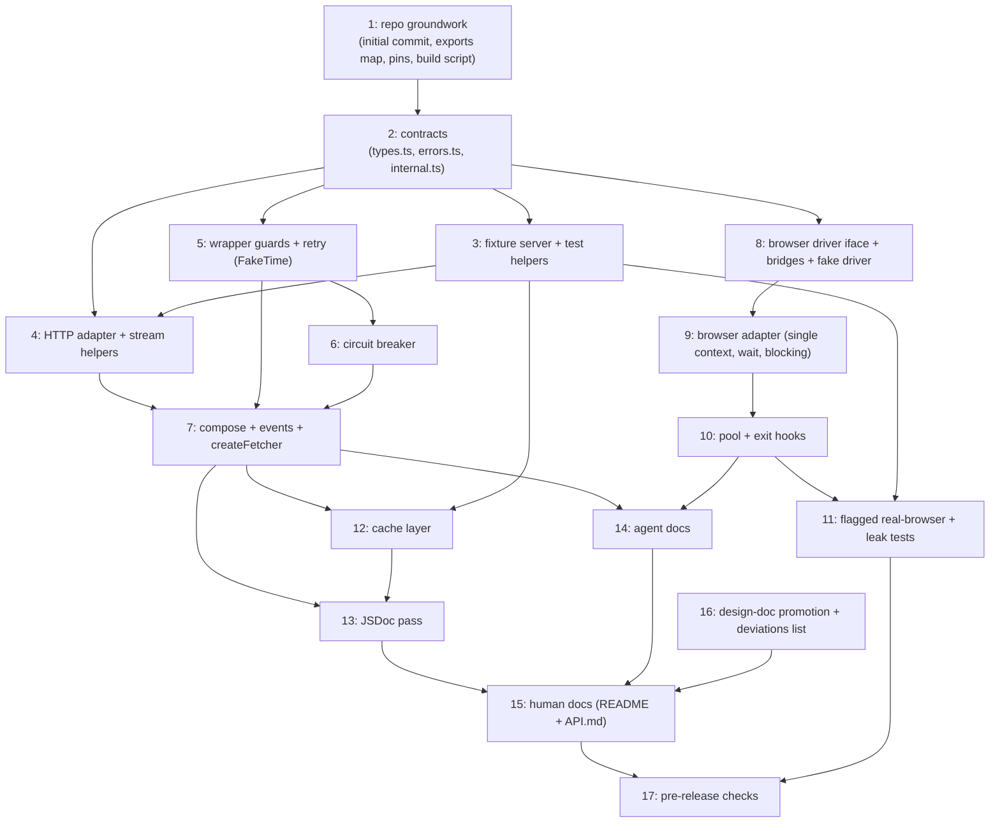

<!--
GENERATED ANALYSIS — @marianmeres/page-fetcher implementation plan
Produced 2026-08-23 by multi-agent research -> adversarial verify -> synthesize.
Claims verified against the design doc (tmp/page-fetcher-DESIGN.md), local ecosystem
sources, and platform checks. Repo is a pre-first-commit scaffold; no code was changed.
-->

# @marianmeres/page-fetcher — Implementation Plan: Overview & Roadmap

> **Overall verdict: the design doc is a strong skeleton with a handful of real,
> load-bearing gaps — none of which invalidate it.** Its core instincts are right and
> survived adversarial verification untouched: one `PageFetchError` with a `kind`
> discriminant, `(next: FetchFn) => FetchFn` layers composed by a plain reduce, the
> adapter contract, non-2xx-resolves-as-data, the §7 "things that quietly break in
> production" list, and the §10 zero-network test posture. Its riskiest platform
> assumption — `redirect: "manual"` returning the real 3xx server-side — was verified to
> hold on both Deno 2.9.5 and Node v26. Where the doc fails is precision, in five
> places: the §9 observability contract is internally inconsistent (a `requestId` that
> no type carries; a per-attempt rule `onResponse`/`onError` cannot satisfy); the §3
> layer rule cannot hold for stream-level guards, and its stack diagram read as
> composition order is wrong for the cache and the deadline; §5.2's "lazily imported"
> browser driver has no working spelling under JSR+npm dual publish; `CachedEntry` is
> named but never defined, and the naive shape is verifiably broken twice (`Headers` →
> `{}`, `Uint8Array` → index junk under JSON); and `retainBody` is referenced but never
> specified.

> **What matters most: three structural decisions, made now, before any code.** (1) The
> wired composition order is `cache → circuit-breaker → retry → guards → adapter
> routing` — a cache hit short-circuits everything, the breaker counts logical outcomes,
> the deadline anchors above retry. (2) The body contract is **eager bytes, lazy
> memoized decode, identical across adapters** — this one decision (resolving design
> §11.1) is what makes the cache layer, retry-discard, and the browser adapter all
> sound. (3) The browser driver is **injection-required** behind a ~10-method structural
> interface with two bundled bridges — which also makes the entire pool/crash/recycle
> logic unit-testable against a fake in-memory driver with zero browsers. Everything
> else in the six docs is careful spec-tightening that can land incrementally.

> **The verification pass bought down most of the platform risk already.** Verified
> live, network-free: `FakeTime` drives both `setTimeout` and `AbortSignal.timeout` on
> Deno 2.9.5 (retry/breaker/guards are fully fake-timer testable); compressed responses
> report the _wire_ `Content-Length` while the reader yields _decoded_ bytes (so
> `maxBytes` counts decoded bytes and the fast-fail is gated on identity encoding);
> `Deno.serve` does not auto-compress (the gzip fixture must be hand-encoded);
> `windows-1250` decodes correctly on both runtimes; `AbortSignal.any` adopts custom
> abort reasons (the timeout/deadline/aborted discrimination protocol works). The
> remaining risk is concentrated in two places: the retry layer (densest logic) and the
> browser pool (largest concurrency surface) — both have full behavioral specs and
> test-first strategies in their docs.

> **How to read `docs/plan/`.** This document is the map; the six numbered docs are the
> territory. Read [`01-public-contracts.md`](./01-public-contracts.md) first — every
> other doc builds on its types. Then [`03-resilience-and-composition.md`](./03-resilience-and-composition.md)
> (the composition-order correction that three docs touch) and
> [`02-http-adapter-and-guards.md`](./02-http-adapter-and-guards.md) (the verified
> platform behaviors). [`04-browser-adapter.md`](./04-browser-adapter.md) and
> [`05-cache-layer.md`](./05-cache-layer.md) are self-contained subsystems;
> [`06-testing-docs-tooling.md`](./06-testing-docs-tooling.md) carries the test
> strategy, packaging, and documentation plan. Each doc ends with "Open questions /
> decisions needed" — those, deduplicated below and in `PROGRESS.md`, are where the
> owner's call is genuinely required.

---

## Top recommendations across all dimensions (ranked)

Ranked for a greenfield build: contract-freezing items first (cheapest now, most
expensive to retrofit), then the layers in dependency order. Effort: S/M/L.

| Rank | Recommendation                                                                                                                                                                                                                                           | Dimension (doc)                                                                                                                                                                          | Value | Effort | Risk | Why now                                                                                                                                                   |
| ---- | -------------------------------------------------------------------------------------------------------------------------------------------------------------------------------------------------------------------------------------------------------- | ---------------------------------------------------------------------------------------------------------------------------------------------------------------------------------------- | ----- | ------ | ---- | --------------------------------------------------------------------------------------------------------------------------------------------------------- |
| 1    | Land the corrected public contracts: `requestId` end-to-end, eager-bytes + lazy-memoized-decode body, per-event granularity, `retainBody`/`hasBody` body-absence model, replayable-body typing, deadline semantics                                       | [01](./01-public-contracts.md) #1–#3, #6–#8                                                                                                                                              | high  | S      | low  | Every layer builds on these types; a greenfield contract retrofitted later churns everything                                                              |
| 2    | Freeze the `PageFetchError` kind union: add `circuit-open` + `no-body`, init-object constructor, realm-safe `is()` guard                                                                                                                                 | [01](./01-public-contracts.md) #4 (+ [03](./03-resilience-and-composition.md) #2)                                                                                                        | high  | S      | low  | Two docs independently require `circuit-open`; the union is public surface — freeze before adapters construct errors                                      |
| 3    | Wire composition as `cache → breaker → retry → guards → routing`, deadline anchored in the outer wrapper; export `compose()`                                                                                                                             | [03](./03-resilience-and-composition.md) #1/#9 (supersedes [05](./05-cache-layer.md) #2 order note, [02](./02-http-adapter-and-guards.md) #3 sketch)                                     | high  | S      | low  | The §3 diagram read literally makes cache hits consult the breaker and inflates its failure count per retry attempt — cheapest structural fix in the plan |
| 4    | Reclassify stream guards (`maxBytes`, content-type, charset) as in-adapter helper modules; keep timeout/deadline as wrapper layers with typed abort reasons via `AbortSignal.any`                                                                        | [02](./02-http-adapter-and-guards.md) #3/#5                                                                                                                                              | high  | M      | low  | §3's wrapper rule is structurally unsatisfiable for stream guards; the timeout/deadline/aborted discrimination protocol must exist before retry does      |
| 5    | clog `Logger` first-class: `logger?: Logger` on every factory, type-only import, silent default, per-layer level map                                                                                                                                     | [01](./01-public-contracts.md) #5, [02](./02-http-adapter-and-guards.md) #9, [03](./03-resilience-and-composition.md) #8, [04](./04-browser-adapter.md) #9, [05](./05-cache-layer.md) #8 | high  | S      | low  | User-mandated across all five layer docs; threading it later touches every factory signature again                                                        |
| 6    | Fixture server module, built EARLY: port 0, dual origin, kill-switch shutdown, hand-gzipped bodies, token-keyed state                                                                                                                                    | [06](./06-testing-docs-tooling.md) #3                                                                                                                                                    | high  | M      | low  | Every I/O test from the HTTP adapter onward depends on it; `Deno.serve` verifiably does not auto-compress                                                 |
| 7    | `readBodyLimited`: `maxBytes` counts decoded bytes; `Content-Length` fast-fail only for identity encoding                                                                                                                                                | [02](./02-http-adapter-and-guards.md) #1                                                                                                                                                 | high  | S      | low  | Verified trap: compressed responses report wire-size `Content-Length` while the reader yields decoded bytes                                               |
| 8    | Manual redirect loop, full hop-by-hop spec: cap, loop detection, 301/302/303 vs 307/308 method rewrite, Authorization + Cookie dropped cross-origin                                                                                                      | [02](./02-http-adapter-and-guards.md) #4                                                                                                                                                 | high  | M      | low  | The design's riskiest platform assumption is verified to hold; the hop rules are where correctness actually lives                                         |
| 9    | Charset pipeline: BOM → header → meta → fallback, unknown labels never throw; windows-1250 raw-byte fixture                                                                                                                                              | [02](./02-http-adapter-and-guards.md) #2, [06](./06-testing-docs-tooling.md) #4                                                                                                          | high  | S      | low  | §7-mandated fixture; BOM-above-header is the one deviation needing owner sign-off                                                                         |
| 10   | Retry layer with `RetryOutcome` either/or signatures: result-based retries, `Retry-After` (secs + HTTP-date), deadline-aware fail-fast, abort-aware sleep                                                                                                | [03](./03-resilience-and-composition.md) #3/#4 (+ [01](./01-public-contracts.md) #7 POST default)                                                                                        | high  | M      | med  | The design's own signatures cannot express its own 429/5xx-retryable table; densest logic in the package — FakeTime tests mandatory                       |
| 11   | Circuit breaker spec: per-instance `Map`, logical-outcome counting, 4xx/429 excluded from failures, single half-open probe, map hygiene                                                                                                                  | [03](./03-resilience-and-composition.md) #5                                                                                                                                              | high  | M      | low  | Four design sentences → a full state machine the crawler depends on                                                                                       |
| 12   | `createFetcher`: options bag, `Fetcher` interface, idempotent `dispose()` + `Symbol.asyncDispose`, adapter routing, event/logger bridging + `safeEmit`                                                                                                   | [03](./03-resilience-and-composition.md) #6/#7/#10, [01](./01-public-contracts.md) #3                                                                                                    | high  | M      | low  | The public front door; also the point where the one real cross-doc contradiction (event granularity — see completeness check) gets resolved in code       |
| 13   | Browser driver: injection-required, ~10-method structural `BrowserDriver` interface, `playwrightDriver`/`puppeteerDriver` bridges, fake in-memory driver                                                                                                 | [04](./04-browser-adapter.md) #1/#2                                                                                                                                                      | high  | M      | low  | Lazy import has no working spelling under JSR+npm dual publish; the fake driver makes the whole browser layer testable browserless                        |
| 14   | Browser adapter + pool: epoch-based crash recovery ("waiters never wedge" invariant), soft-hybrid `networkidle` default wait, resource blocking on by default, cross-runtime exit hooks                                                                  | [04](./04-browser-adapter.md) #3/#4/#5/#6/#7/#8                                                                                                                                          | high  | L      | med  | The largest single work item and the historical rot-spot of browser tooling; the spec's invariant is directly testable against the fake driver            |
| 15   | Cache layer serialization-first: versioned `CachedEntry` (plain lowercase headers, `set-cookie` stripped, out-of-band body), `createCacheLayer` dev/conditional state machine, GET-only request-derived keys, `fromCache`/`notModified` synthesis matrix | [05](./05-cache-layer.md) #1–#6                                                                                                                                                          | high  | S–M    | low  | `CachedEntry` is named-but-undefined in the design and the naive shape is verifiably broken twice                                                         |
| 16   | Packaging alignment: deno.json exports map + flat barrels (`src/adapters.ts`, `src/cache.ts`), build-npm.ts `[""]` placeholder replaced, `@std/testing` pin, scoped test tasks                                                                           | [06](./06-testing-docs-tooling.md) #1/#8                                                                                                                                                 | high  | S      | low  | npm/JSR export maps stay in sync only via flat barrels; the placeholder must become the clog decision                                                     |
| 17   | Test posture: FakeTime + stub `next` for retry/breaker/guards (zero sockets/sleeps); 12-file matrix; browser suite double-gated (`--ignore` + `BROWSER_TESTS`); best-effort ps-scan leak test                                                            | [06](./06-testing-docs-tooling.md) #2/#4/#5                                                                                                                                              | high  | M      | low  | FakeTime verifiably drives both `setTimeout` and `AbortSignal.timeout` on Deno; unit files never import the fixture server                                |
| 18   | Documentation set: AGENTS.md + docs/{architecture,conventions,tasks}.md + CLAUDE.md redirect; README (two §5.3/§8 recipes, two loud notes) + API.md; promote `tmp/` design doc to `docs/design.md`                                                       | [06](./06-testing-docs-tooling.md) #6/#7/#10/#11                                                                                                                                         | high  | M      | low  | `tmp/` is gitignored — without promotion the founding document never gets committed; npmbuild ships docs/ for free                                        |

**Deliberately omitted / deferred** (recorded so they are not re-proposed without a
trigger): cookie jar — out of v1 entirely, not even an interface stub (02 #10, confirms
design §11.3); HEAD-then-GET helper (design §11.4 — a crawler concern, nothing to
build); HTTP/2 / keep-alive tuning (design §11.2 — defer to platform, confirmed);
`Vary` handling (05 #3 — the `key` override callback is the escape hatch);
HEAD-response caching (05 #3); serve-stale-on-circuit-open / `stale-if-error` (03/05
open question — v2 candidate); memory-store byte-budget cap (05 #5 — `maxEntries` +
`maxBytes` bound the product); browser-per-slot pool (04 #3); lazy driver import
(dropped as unworkable, 04 #1); wire-byte `bytes()` via CDP (04 #5 — browser `bytes()`
is the serialized DOM, documented); version-embedded User-Agent (02 #8 — version-less
v1); `URLPattern` in blocking option types (04 #6); dev-time adapter-name cross-check
(03 #10, cut); a `/big-cl` fixture route (06 #3, cut).

---

## Recommended first sprint (do these 3–5 first)

The design's §12 order (types → http → guards → retry → breaker → composition → browser
→ pool → cache → tests/docs) is respected with two corrections from the dimension docs:
the fixture server moves EARLY (every I/O test from the HTTP adapter onward consumes
it), and the guards work is split per doc 02 (stream helpers land with the adapter,
wrapper guards land with retry). The sprint deliverable is a complete, tested,
HTTP-only fetcher — which doc 04 #10 confirms is a shippable, useful core on its own.

**1. Repo groundwork + packaging alignment (Rank 16).** First because the repo has zero
commits: the initial commit of the scaffold + this plan is the actual first act, and it
forces two decisions immediately — the `docs/design.md` promotion (06 #10: `tmp/` is
gitignored, so without it the founding document is silently excluded from history) and
the branch model (see `PROGRESS.md` open note). Alongside: the deno.json exports map +
flat barrels, dependency pins (`@marianmeres/clog@^3.21.0`, `@std/testing@^1.0.18`),
scoped test tasks, and replacing build-npm.ts's `[""]` placeholder with the clog
decision (open question 2). Detail: **06 #1/#8/#10/#12**.

**2. Public contracts: `src/types.ts`, `src/errors.ts`, `src/internal.ts` (Ranks 1–2).**
The whole doc set converges on doc 01's corrected contract — `requestId` as a
first-class field with the idempotent generation rule, eager-bytes/lazy-decode via the
shared `createBodyResult` helper, the `retainBody`/`hasBody`/`no-body` body-absence
model, the final kind union including `circuit-open`, `ObservabilityOptions` with the
type-only clog `Logger`, and the `mod.ts` export surface. Landing this first means no
other task ever builds against a moving target. Includes `tests/errors.test.ts` and the
public-surface smoke test. Detail: **01 #1–#10**.

**3. Fixture server + test helpers (Ranks 6, 17-part).** Before the HTTP adapter,
because its tests consume it on day one. `tests/fixtures/server.ts` (port 0, second
origin for cross-origin credential-drop tests, kill-switch shutdown so `/hang` cannot
deadlock teardown, hand-gzipped route, token-keyed stateful routes),
`tests/fixtures/bytes.ts` (the raw-byte windows-1250 fixture — `TextEncoder` cannot
produce it), and `tests/helpers.ts` (stub `FetchFn` builders, recording fake logger).
Detail: **06 #2/#3/#4**.

**4. HTTP adapter + stream-guard helpers (Ranks 4-part, 7, 8, 9).** `src/read-body.ts`
(decoded-byte `maxBytes`, identity-gated fast-fail), `src/content-type.ts` (parse +
allow-list with the `+json` gap fixed), `src/charset.ts` (BOM-first pipeline, never
throws), and `src/adapters/http.ts` (manual redirect loop with method rewrite and
cross-origin credential drops, default UA, honest timing) — plus the http-adapter,
charset, and guards test files against the fixture server. Resolves open questions 4
(non-replayable bodies) and 5 (charset precedence) before code. Detail: **02
#1/#2/#4/#6/#7/#8**.

**5. Wrapper guards + retry layer (Ranks 4-part, 10).** `src/guards.ts`
(`timeoutGuard` below retry, deadline anchoring per doc 03 #9, `composeSignal` with the
typed-abort-reason discrimination protocol), `src/utils.ts` (`sleep(ms, signal)`,
`resolveDeadline`), and `src/retry.ts` with the `RetryOutcome` either/or signatures,
the full classification table (incl. the `too-many-redirects` and `circuit-open`
additions), `Retry-After` parsing, and deadline-aware fail-fast — all tested on
FakeTime with stub `next`, zero real sleeps. Resolves open question 4 (POST retry
default). Detail: **02 #5, 03 #3/#4/#9**.

Backlog picks up at the circuit breaker and `createFetcher` (which is where the
01-vs-03 event-granularity resolution lands in code), then the browser subsystem, then
cache, then docs — see `PROGRESS.md`.

---

## Cross-cutting themes

- **Body eagerness is one decision that ripples through four docs.** Doc 01 fixes it
  (eager bytes, lazy memoized decode, all adapters); doc 02 depends on it (the adapter
  streams for `maxBytes` anyway, so buffering is free); doc 05 requires it (an
  intermediate layer must read the body without consuming it; `CachedEntry` stores
  bytes); doc 04 confirms it (the page is released back to the pool, so lazy is
  impossible there). The memoized `bytes()`/`text()` pair from `src/internal.ts` is the
  single mechanism enforcing it everywhere.

- **Injection over magic, everywhere.** The browser driver is injected (lazy import is
  unworkable under dual publish); the platform `fetch` is injectable in the HTTP
  adapter (making unit tests socket-free); the cache store is injected; the logger is
  injected; events are injected. Nothing is auto-discovered, nothing is imported on the
  consumer's behalf, and the zero-runtime-dependency promise stays trivially auditable.

- **Logger + events duality, one rule.** Events are the machine channel with defined
  granularity; the clog `Logger` is the human channel, silent by default, threaded as
  `logger?: Logger` through every factory. The shared discipline across all five layer
  docs: errors are _thrown_ (and emitted via `onError`) — never also logged at `error`
  level by inner layers, so nothing double-reports. Each doc carries its own
  debug/warn level map.

- **Per-attempt vs per-logical-request accounting is defined per field and per event.**
  `attempts` is owned by the retry layer (adapters always report 1, cache hits report
  0); the breaker counts logical outcomes, not attempts; `timing` spans the logical
  request; `requestId` is stable across attempts. The event-side granularity is the one
  place two docs genuinely diverged — see the completeness check.

- **No background timers, no global state, no leaked resources.** The breaker's `Map`
  is per-instance; the memory cache has no TTL sweeper; `AbortSignal.timeout` is
  avoided in guards because its timer cannot be canceled; the pool clears waiter timers
  and unregisters exit hooks on dispose; redirect bodies are explicitly canceled. This
  is not just hygiene — Deno's default test sanitizers turn every violation into a test
  failure, which the plan uses as a free assertion layer.

- **Kinds over strings, and `TypeError` for programmer errors.** New kinds
  (`circuit-open`, `no-body`) exist so callers never match message strings; conversely,
  unknown adapter names and use-after-dispose throw plain `TypeError`/`Error` —
  deliberately not `PageFetchError`, because they are not fetch outcomes and must never
  enter retry classification.

---

## Dependency / sequencing notes

Reading: contracts (2) gate everything; the fixture server (3) gates every I/O test
and must precede the HTTP adapter (4). Retry (5) precedes the breaker (6) only because
they share `RetryOutcome` and the classification table; both plus the HTTP adapter gate
`createFetcher` (7). The browser chain (8→9→10→11) needs only the contracts and can
proceed in parallel with 4–7 — doc 04 #10 notes that if crawler integration is
imminent, task 8+9 (driver interface + single-context adapter, no pool) is the minimal
unblock. Cache (12) composes into the fetcher, so it follows 7. Docs (13–15) follow the
code they describe so they don't immediately rot; the design-doc promotion (16) should
ideally be decided at initial-commit time (task 1) since `tmp/` is gitignored.

---

## Completeness check

The six docs were checked against each other. One genuine contradiction, two
resolved-by-ownership divergences, and one false alarm:

- **Event granularity: doc 01 vs doc 03 genuinely contradict — resolved in favor of
  doc 01; needs owner ratification.** Doc 01 #3 defines `onResponse`/`onError` as
  terminal, once per logical request (invariant: N × `onRequest`, N−1 × `onRetry`,
  exactly one terminal event), emitted by `createFetcher`'s outermost instrumentation.
  Doc 03 #1/#7 places an events layer _below_ retry and fires
  `onRequest`/`onResponse`/`onError` per attempt, following §9's literal wording.
  These cannot both hold: under doc 03's reading a retried `ok: false` 503 fires
  multiple `onResponse` events for one logical request and "exactly one terminal
  event" breaks. Doc 01 is the contracts owner and its reading is the implementable
  one (a failed attempt has no `FetchResult` to emit; per-attempt visibility is fully
  covered by `onRequest` + `onRetry`). **Resolution: doc 01's granularity wins; doc 03
  #7's firing-point table is adjusted at backlog task 7** — terminal events from the
  outer instrumentation, per-attempt `onRequest` from the retry layer (or the
  instrumentation itself when retry is disabled), cache-hit `onResponse` bridged by
  the cache layer (which also resolves doc 05 #8's "pure hits are invisible" concern).
  Flagged as open question 3.

- **Composition order: three docs, three sketches — doc 03 owns it; reconciled order
  stated here.** Doc 03 #1 (cache outermost), doc 02 #3 (`events → deadline → cache →
  retry → timeout → adapter`), and doc 05 #2 (one line calling §3's literal
  retry-above-cache order "sound") diverge. Doc 03's analysis is the strongest (a
  cache hit must not consult an open breaker; the breaker must count logical
  outcomes) and doc 05's mechanics are position-independent, so its order note is
  superseded. Doc 02's real requirement — deadline above retry — survives via doc 03
  #9: **reconciled wired order: outer wrapper (normalize + `requestId` stamp +
  deadline anchor + already-expired fail-fast) → cache → circuit-breaker → retry
  (owns sleep budgeting against the anchored deadline) → per-attempt timeout guard →
  adapter routing.**

- **Error payload details: minor 01/03 divergence, resolved by ownership.** Both add
  `circuit-open`; doc 01 #4 puts `{ host, until }` in the error's generic `details`
  bag, doc 03 #2 says "not via new error fields, events only". Doc 01 owns the error
  shape and `details` adds no named fields — **doc 01 wins** (strictly more
  informative, costs nothing). Similarly `RetryOptions.onRetry`/`FetcherEvents.onRetry`
  payloads: doc 01's sketch carries a mandatory `err`, doc 03 #3 makes it the
  `RetryOutcome` either/or — doc 01 explicitly defers retry internals to doc 03, so
  **the either/or wins**; the shared exported type becomes
  `RetryInfo = { requestId, url, attempt, delay } & RetryOutcome`. The related open
  point (should the `http`-kind error carry headers so `Retry-After` is honorable on
  the `throwOnHttpError` path) remains open — doc 03 #4 applies plain backoff there
  until doc 01 rules.

- **Body eagerness across 01/02/04/05: no contradiction — one wording trap.** Doc 02
  #2's note "HTTP `text()` is lazy" means lazy _decode_ of already-buffered bytes,
  which is exactly doc 01 #2's contract (eager bytes, lazy memoized decode); docs 04
  and 05 build on the same contract. Aligned — but the doc 02 phrasing should not be
  copied into JSDoc verbatim.

Everything else is covered and mutually consistent: the `circuit-open` kind
(01/03), the deadline anchoring rule (01 #8, 02 #5, 03 #9 — same rule, three
perspectives), the logger convention (all five layer docs, identical mechanics), the
GET-only cache keying vs adapter routing (05 #3 correctly derives the key from the
request because routing resolves below the cache), and the fake-driver test strategy
(04 #2 and 06 #5 describe the same artifact).

Source documents: [`01-public-contracts.md`](./01-public-contracts.md),
[`02-http-adapter-and-guards.md`](./02-http-adapter-and-guards.md),
[`03-resilience-and-composition.md`](./03-resilience-and-composition.md),
[`04-browser-adapter.md`](./04-browser-adapter.md),
[`05-cache-layer.md`](./05-cache-layer.md),
[`06-testing-docs-tooling.md`](./06-testing-docs-tooling.md).
